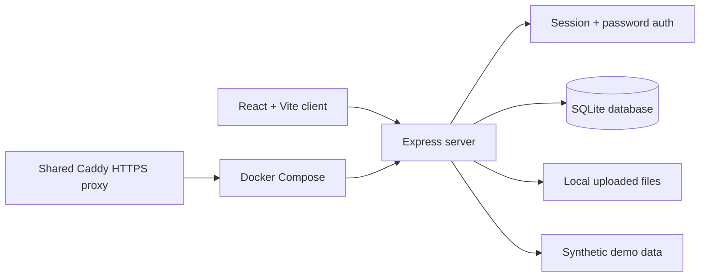

# Family Hub

Family Hub is a private household command center for day-to-day life: bills,
home upkeep, documents, notes, and the things a household needs to remember
without spreading them across text threads and random folders.

## Status

Production app with a private login and a read-only public demo mode. The repo
is designed to show both the product surface and the operational path from local
development to a VPS deployment.

## What It Does

- `Today` dashboard for near-term household deadlines and reminders
- `Money` area for bills, payment status, recurrence, and history
- `Home` area for maintenance tasks and replacement reminders
- `Docs` area for important household files and reference material
- `Notes` area for quick household capture
- Password-protected access with first-user setup on a fresh database
- Read-only demo mode with synthetic sample data for portfolio links
- SQLite persistence and local file storage for uploaded documents

## Architecture



The application runs as one Express process in production. It serves the built
frontend, handles same-origin API requests, stores structured data in SQLite,
and stores uploaded files on a mounted data volume.

## Stack

- Frontend: React, Vite, TypeScript, CSS
- Backend: Node.js, Express
- Data: SQLite through `better-sqlite3`
- Storage: local filesystem uploads
- Deployment: Docker Compose behind Caddy on a VPS
- Testing: Node test runner for backend API coverage

## Local Development

Install dependencies:

```bash
npm install
```

Run the backend and frontend in separate terminals:

```bash
npm run dev:server
```

```bash
npm run dev
```

Open `http://localhost:5173`.

### One-command full local testing

To build and run the complete application in normal authenticated mode:

```bash
npm run local:test
```

Then open `http://127.0.0.1:8787`. On the first run, the login screen asks you
to create the first household account. This is **not demo mode**: bills, tasks,
items, notes, document uploads, edits, recurring actions, and deletes are all
enabled. A small set of editable sample records is inserted when the local
database is empty.

The command:

- installs dependencies when `node_modules` is missing
- runs TypeScript validation and builds the production client
- starts the real Express API and React application together
- stores its isolated database and uploads under `data/local-test`
- preserves that data between runs

Stop it with `Ctrl+C`. To use another port or data directory:

```bash
PORT=8891 npm run local:test
DATA_DIR=/tmp/family-hub-test npm run local:test
```

Do not add `?demo=1` to the URL when testing editable behavior.

For a production-style local run:

```bash
npm run build
npm start
```

Open `http://localhost:8787`.

## Demo Mode

The login page supports a read-only demo query string:

```text
https://family.bghimire.com/login?demo=1
```

Demo mode:

- uses synthetic sample bills, tasks, documents, items, and notes
- never reads real household data
- blocks non-GET `/api/*` requests with `403`
- hides add, edit, delete, and upload controls

## Verification

Run backend API tests:

```bash
npm run test:e2e
```

Run a production build:

```bash
npm run build
```

Health check:

```bash
curl -f http://localhost:8787/api/health
```

## Deployment

Production deployment uses the shared VPS infrastructure repo:

- Infrastructure runbook: `https://github.com/biswashghi/hetzner_tf`
- Repo-specific notes: `docs/hetzner-production.md`

Typical deploy flow:

```bash
cd ../hetzner_tf
./scripts/deploy-vps-prod-from-tf.sh family_hub main
```

The deploy wrapper refreshes the shared Caddy config, pulls the selected branch
on the VPS, writes the production environment file, and runs Docker Compose.

## Persistent Data

- SQLite database: `/app/data/family_hub.sqlite`
- Uploaded files: `/app/data/files`
- Docker volume: `family-hub-data`

Create a backup:

```bash
npm run backup:data
```

## Design Notes

This project intentionally favors a small self-hosted architecture over a larger
cloud stack. A single process, SQLite, and a Docker volume keep the deployment
easy to reason about while still covering real concerns: auth, demo isolation,
backups, persistent uploads, and repeatable deployment.
